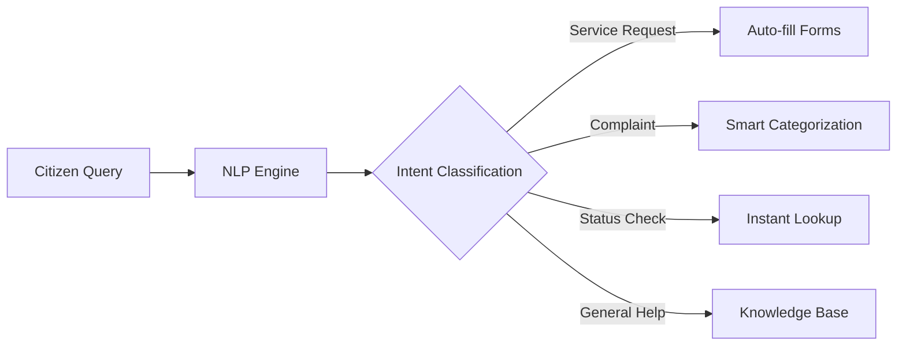
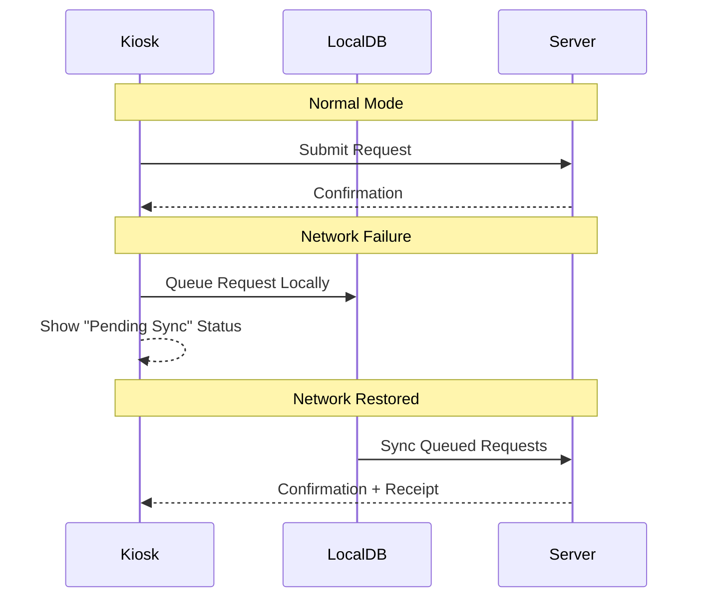
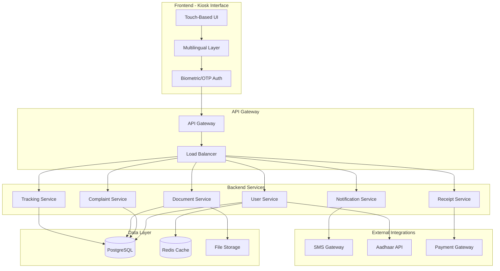
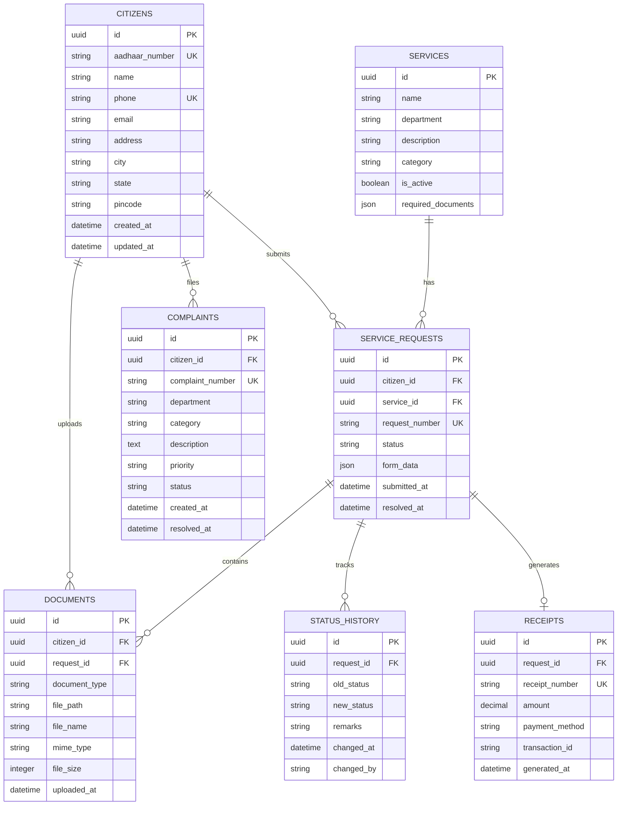
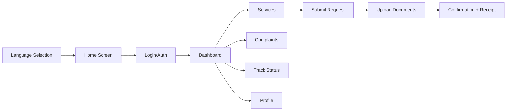
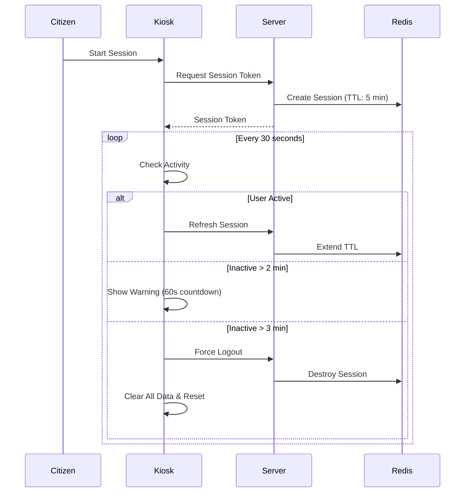
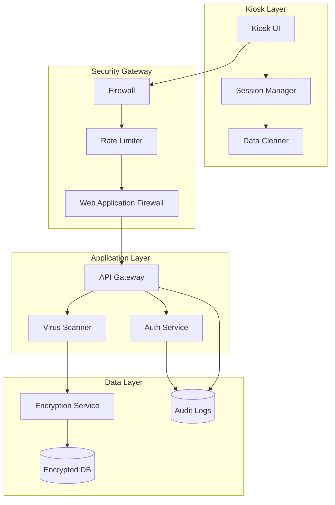

# SUVIDHA 2026 - Architecture & Implementation Plan

Smart Urban Virtual Interactive Digital Helpdesk Assistant for public utility services.

---

## 🎯 Project Overview

Build a **touch-based kiosk interface** for citizen-government interactions across multiple utility departments:
- ⚡ Electricity Utility
- 🔥 Gas Distribution  
- 💧 Water Supply & Municipal Services
- 🗑️ Waste Management

---

## 🚀 Innovative Features (Hackathon Differentiators)

These features will make SUVIDHA stand out from typical kiosk implementations:

### 1. 🤖 AI-Powered Smart Assistant



| Feature | Description |
|---------|-------------|
| **Voice Input** | Speech-to-text for hands-free interaction (Hindi + English) |
| **Smart Suggestions** | Auto-complete based on common requests |
| **Sentiment Analysis** | Prioritize complaints from frustrated citizens |
| **Chatbot Fallback** | 24/7 assistance when office is closed |

### 2. ♿ Accessibility First Design

| Feature | Implementation |
|---------|----------------|
| **Screen Reader** | Full ARIA labels, keyboard navigation |
| **High Contrast Mode** | One-tap toggle for visually impaired |
| **Large Text Mode** | 150% font scaling option |
| **Voice Navigation** | "Press 1 for Services, 2 for Complaints..." |
| **Wheelchair Accessible** | UI optimized for lower screen viewing |
| **Sign Language Videos** | Pre-recorded instruction videos with ISL |

### 3. 📴 Offline Mode (Network Resilience)



- **Local Queue**: Requests stored in IndexedDB when offline
- **Auto-Sync**: Background sync when connection restored
- **Offline Status Check**: Cached status for recent requests
- **Graceful Degradation**: Core features work without network

### 4. 🔗 Government Integrations

| Integration | Purpose |
|-------------|---------|
| **DigiLocker** | One-tap document fetch (Aadhaar, PAN, etc.) |
| **UPI/BHIM** | In-kiosk bill payments |
| **Umang App** | Cross-platform request sync |
| **SMS/WhatsApp** | Status updates on citizen's phone |
| **e-Sign** | Digital signature for applications |

### 5. 🎫 Smart Queue Management

```
┌─────────────────────────────────────────────────────────────┐
│                    Token System Integration                  │
├─────────────────────────────────────────────────────────────┤
│  📱 Book Token     → Schedule appointment from home         │
│  🎫 Walk-in Token  → Get queue number at kiosk              │
│  📊 Live Queue     → Display current wait time              │
│  🔔 SMS Alert      → "Your turn in 5 minutes"               │
│  🖨️ Print Token    → Physical token with QR code            │
└─────────────────────────────────────────────────────────────┘
```

### 6. 📊 Analytics Dashboard (Admin Portal)

| Metric | Use Case |
|--------|----------|
| **Peak Hours** | Staff scheduling optimization |
| **Common Complaints** | Identify systemic issues |
| **Service Time** | Process efficiency tracking |
| **Citizen Satisfaction** | Post-service rating trends |
| **Kiosk Health** | Uptime, errors, maintenance alerts |

### 7. 📝 Smart Form Auto-Fill

- **OCR Document Scanning**: Scan ID cards to auto-fill forms
- **Previous Request Memory**: Pre-fill from citizen's history
- **Address Auto-Complete**: India Post PIN code integration
- **Smart Validation**: Real-time field validation with helpful hints

### 8. 🆘 Emergency Features

| Feature | Description |
|---------|-------------|
| **SOS Button** | Direct line to emergency services |
| **Nearest Office Locator** | GPS-based office finder |
| **Water Outage Alerts** | Push notifications for area-wide issues |
| **Disaster Mode** | Simplified interface during emergencies |

### 9. ⭐ Feedback & Gamification

```
┌─────────────────────────────────────────────────────────────┐
│                    Citizen Engagement                        │
├─────────────────────────────────────────────────────────────┤
│  ⭐ Post-Service Rating  → 5-star + optional comment        │
│  🏆 Civic Points         → Earn points for timely payments  │
│  🎁 Rewards              → Redeem for bill discounts        │
│  📈 Leaderboard          → Ward-wise civic participation    │
└─────────────────────────────────────────────────────────────┘
```

### 10. 🖨️ Hardware Integrations

| Hardware | Function |
|----------|----------|
| **Thermal Printer** | Receipt/token printing |
| **QR Scanner** | Scan existing request QR for status |
| **Biometric Reader** | Aadhaar-based authentication |
| **Card Reader** | Credit/debit card payments |
| **Camera** | Selfie verification, document scanning |

---

## 🏗️ System Architecture



---

## 📁 Proposed Project Structure

```
e:\Suvida\
├── frontend/                    # Kiosk UI Application
│   ├── public/
│   │   └── index.html
│   ├── src/
│   │   ├── components/         # Reusable UI components
│   │   │   ├── common/        # Buttons, inputs, modals
│   │   │   ├── auth/          # Authentication screens
│   │   │   ├── services/      # Service-specific components
│   │   │   └── layout/        # Navigation, headers
│   │   ├── pages/             # Main screen views
│   │   │   ├── Home.jsx
│   │   │   ├── Login.jsx
│   │   │   ├── Dashboard.jsx
│   │   │   ├── Services.jsx
│   │   │   ├── Complaints.jsx
│   │   │   ├── Documents.jsx
│   │   │   └── Status.jsx
│   │   ├── services/          # API integration layer
│   │   ├── i18n/              # Multilingual translations
│   │   │   ├── en.json
│   │   │   ├── hi.json
│   │   │   ├── ta.json
│   │   │   └── ...
│   │   ├── styles/            # CSS/SCSS files
│   │   ├── utils/             # Helper functions
│   │   └── App.jsx
│   └── package.json
│
├── backend/                    # API Server
│   ├── src/
│   │   ├── controllers/       # Request handlers
│   │   ├── services/          # Business logic
│   │   ├── models/            # Database models
│   │   ├── routes/            # API routes
│   │   ├── middleware/        # Auth, validation, logging
│   │   ├── utils/             # Helpers
│   │   └── app.js
│   ├── config/
│   │   └── database.js
│   └── package.json
│
├── database/                   # Database scripts
│   ├── migrations/
│   └── seeds/
│
├── docs/                       # Documentation
│   ├── api/
│   └── user-guide/
│
└── docker-compose.yml          # Container orchestration
```

---

## 💾 Database Schema Design



---

## 🔌 API Endpoints Structure

### Authentication
| Method | Endpoint | Description |
|--------|----------|-------------|
| POST | `/api/auth/send-otp` | Send OTP to phone |
| POST | `/api/auth/verify-otp` | Verify OTP & login |
| POST | `/api/auth/aadhaar-verify` | Verify via Aadhaar |
| POST | `/api/auth/logout` | End session |

### Citizens
| Method | Endpoint | Description |
|--------|----------|-------------|
| GET | `/api/citizens/profile` | Get citizen profile |
| PUT | `/api/citizens/profile` | Update profile |
| GET | `/api/citizens/dashboard` | Dashboard summary |

### Services
| Method | Endpoint | Description |
|--------|----------|-------------|
| GET | `/api/services` | List all services |
| GET | `/api/services/:id` | Service details |
| POST | `/api/services/request` | Submit service request |
| GET | `/api/services/requests` | My requests |
| GET | `/api/services/requests/:id` | Request details |

### Complaints
| Method | Endpoint | Description |
|--------|----------|-------------|
| POST | `/api/complaints` | File complaint |
| GET | `/api/complaints` | My complaints |
| GET | `/api/complaints/:id` | Complaint details |

### Documents
| Method | Endpoint | Description |
|--------|----------|-------------|
| POST | `/api/documents/upload` | Upload document |
| GET | `/api/documents/:id` | Download document |
| DELETE | `/api/documents/:id` | Delete document |

### Status & Receipts
| Method | Endpoint | Description |
|--------|----------|-------------|
| GET | `/api/status/:requestId` | Track request status |
| GET | `/api/receipts/:requestId` | Get receipt |
| GET | `/api/receipts/:id/download` | Download PDF receipt |

---

## 🛠️ Technology Stack

| Layer | Technology | Rationale |
|-------|------------|-----------|
| **Frontend** | React.js + Vite | Fast, component-based, great for touch UIs |
| **Styling** | CSS3 + CSS Variables | Full control, custom design system |
| **State Management** | React Context + useReducer | Lightweight, sufficient for kiosk |
| **Backend** | Node.js + Express | Fast development, JavaScript ecosystem |
| **Database** | PostgreSQL | Robust, ACID-compliant, JSON support |
| **Cache** | Redis | Session storage, OTP caching |
| **File Storage** | Local/S3 Compatible | Document uploads |
| **Authentication** | JWT + OTP | Stateless, secure |
| **i18n** | react-i18next | Industry standard for multilingual |

---

## 🎨 UI/UX Design Principles

### Kiosk-Specific Considerations
1. **Large Touch Targets** — Minimum 48x48px buttons, ideally 64px+
2. **High Contrast** — WCAG AA compliant colors
3. **Simple Navigation** — Max 3 levels deep
4. **Session Timeout** — Auto-logout after inactivity
5. **On-Screen Keyboard** — For text input
6. **Voice Feedback** — Audio cues for accessibility

### Screen Flow


---

## 🌐 Multilingual Support

Initial language support:
- 🇬🇧 English
- 🇮🇳 Hindi (हिंदी)
- 🇮🇳 Tamil (தமிழ்)
- 🇮🇳 Telugu (తెలుగు)
- 🇮🇳 Kannada (ಕನ್ನಡ)
- 🇮🇳 Marathi (मराठी)

---

## 🔐 Security Framework (Public Kiosk)

Since this is a **public kiosk** accessible by anyone, we implement multiple layers of security:

### 1. Session Security



| Feature | Implementation |
|---------|----------------|
| **Auto-Logout** | 3-minute inactivity timeout with 60-second warning |
| **Session Token** | Short-lived JWT (5 min), refreshed on activity |
| **Force Reset** | Hardware "End Session" button always visible |
| **No "Remember Me"** | Never store credentials locally |

### 2. Data Protection Layers

| Layer | Protection Measure |
|-------|-------------------|
| **In Transit** | TLS 1.3 encryption for all API calls |
| **At Rest** | AES-256 encryption for sensitive DB fields (Aadhaar, phone) |
| **In Memory** | No sensitive data in localStorage; sessionStorage only with encryption |
| **On Screen** | Masked display (Aadhaar: XXXX-XXXX-1234, Phone: XXXXXX7890) |

### 3. Automatic Data Cleanup

```javascript
// Runs on EVERY session end (logout, timeout, or manual reset)
const cleanupSession = () => {
  // 1. Clear all browser storage
  sessionStorage.clear();
  localStorage.clear();
  
  // 2. Clear all form inputs
  document.querySelectorAll('input').forEach(el => el.value = '');
  
  // 3. Clear file upload cache
  clearUploadedDocuments();
  
  // 4. Reset navigation to home
  navigateTo('/');
  
  // 5. Clear any cached images/documents
  caches.keys().then(keys => keys.forEach(key => caches.delete(key)));
  
  // 6. Server-side: Invalidate session token
  api.post('/auth/logout');
};
```

### 4. Authentication Security

| Measure | Description |
|---------|-------------|
| **OTP Expiry** | 3-minute validity, single-use |
| **Rate Limiting** | Max 3 OTP requests per phone per 10 minutes |
| **Brute Force Protection** | Lock after 5 failed attempts (30 min cooldown) |
| **CAPTCHA** | Required after 2 failed OTP attempts |

### 5. Document Upload Security

| Risk | Mitigation |
|------|------------|
| **Malware Upload** | File type whitelist (PDF, JPG, PNG only) |
| **Size Limit** | Max 5MB per file, 20MB per session |
| **Temporary Storage** | Uploaded files auto-delete after session ends |
| **Virus Scan** | Server-side ClamAV scan before storage |
| **No Preview Cache** | Documents rendered server-side, never cached locally |

### 6. Physical Kiosk Security

| Feature | Implementation |
|---------|----------------|
| **Privacy Screen** | UI designed for narrow viewing angle |
| **Screen Masking** | Sensitive fields auto-hide after 5 seconds |
| **Audio Alerts** | Beep on session timeout warning |
| **Big "End Session" Button** | Always visible, one-tap full reset |
| **No USB Ports Exposed** | Prevent device attacks |

### 7. API Security

```
┌─────────────────────────────────────────────────────────────┐
│                     API Security Layers                      │
├─────────────────────────────────────────────────────────────┤
│  Rate Limiting     → 100 requests/min per kiosk             │
│  JWT Validation    → Token verified on every request         │
│  Input Sanitization→ XSS & SQL injection prevention          │
│  CORS Policy       → Only allow registered kiosk origins     │
│  Request Signing   → HMAC signature for sensitive endpoints  │
│  Audit Logging     → All actions logged with timestamps      │
└─────────────────────────────────────────────────────────────┘
```

### 8. Audit Trail

Every action is logged for security and compliance:

```json
{
  "timestamp": "2026-02-01T12:30:00Z",
  "kiosk_id": "KIOSK-BLR-001",
  "session_id": "abc123",
  "citizen_id": "masked",
  "action": "SERVICE_REQUEST_SUBMITTED",
  "ip_address": "10.0.0.5",
  "metadata": {
    "service_type": "NEW_CONNECTION",
    "department": "ELECTRICITY"
  }
}
```

### Security Architecture Diagram



---

## ✅ Verification Plan

### Automated Testing
```bash
# Frontend tests
cd frontend && npm test

# Backend tests  
cd backend && npm test

# E2E tests
npm run test:e2e
```

### Manual Testing Checklist
1. **Authentication Flow** — OTP send/verify works
2. **Service Request** — Can submit request with documents
3. **Complaint Filing** — Can file and track complaints
4. **Status Tracking** — Real-time updates visible
5. **Receipt Generation** — PDF downloads correctly
6. **Multilingual** — All screens render correctly in each language
7. **Touch Interface** — All buttons respond to touch
8. **Accessibility** — Screen reader compatible

---

## 🚀 Implementation Phases

### Phase 1: Foundation (Week 1)
- [x] Architecture design *(current)*
- [ ] Project scaffolding
- [ ] Database setup
- [ ] Basic authentication

### Phase 2: Core Features (Week 2)
- [ ] Service request module
- [ ] Complaint module
- [ ] Document upload
- [ ] Status tracking

### Phase 3: Polish (Week 3)
- [ ] Receipt generation
- [ ] Multilingual support
- [ ] UI polish & animations
- [ ] Testing & bug fixes

---

## User Review Required

> [!IMPORTANT]
> **Technology Choices**: This plan uses React + Node.js + PostgreSQL. Let me know if you prefer a different stack (e.g., Python/Django, Angular, MongoDB).

> [!IMPORTANT]
> **Scope Confirmation**: Should we build all utility modules (Electricity, Gas, Water, Municipal) or start with one as a pilot?

> [!IMPORTANT]
> **Authentication Method**: The plan includes OTP-based auth. Do you need Aadhaar-based biometric integration for the hackathon demo?

---

## Next Steps After Approval

1. Initialize the project with Vite + React
2. Set up the backend with Express
3. Create the database schema
4. Build the authentication flow
5. Develop the service modules one by one
